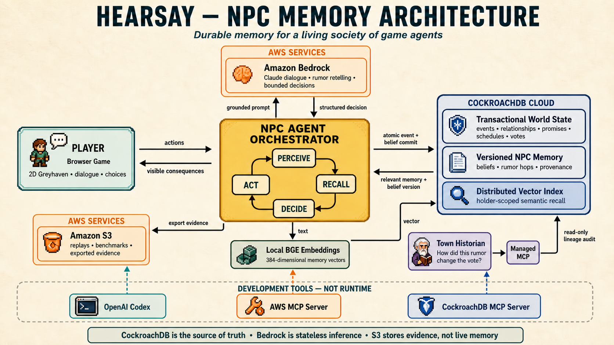

# Hearsay

**The truth is what survives the telling.**

Hearsay is a browser-based social-memory game set in Greyhaven. You have three
days to shape a mayoral election in a town where NPCs remember conversations,
spread changing rumors, and vote from the experiences that reached them.

[Play the replay demo](https://hearsay.ashutoshmishra.dev/) ·
[Watch the project video](https://youtu.be/AuKoOJfKwqE)

## Why it matters

Most game NPCs remember isolated conversations. Hearsay uses CockroachDB as the
durable memory layer for an entire NPC society: each resident holds their own
beliefs, every retelling keeps its lineage, and decisive memories can be traced
to the election result they influenced.

## Architecture



The player acts, an NPC recalls holder-scoped memories through CockroachDB's
vector index, Amazon Bedrock produces a bounded response or decision, and the
validated consequence returns to CockroachDB in a serializable transaction.
The Town Historian audits rumor lineage through Managed MCP.

## Highlights

- A walkable 2D town with twenty residents and a three-day campaign
- Private NPC memory, shared town memory, and versioned rumor transmission
- Semantic recall with immutable belief versions and decision provenance
- Persistent relationships, promises, schedules, weather, and election votes
- An explainable finale that cites the memories behind decisive votes

## Technology

**Next.js · React · FastAPI · CockroachDB Cloud · Distributed Vector Indexing ·
Managed MCP · Amazon Bedrock · Amazon S3 · BGE embeddings**

## Run locally

Requires Node.js 22 and pnpm 11.9.0.

```powershell
pnpm bootstrap
pnpm doctor
pnpm play
```

Open `http://localhost:3000`.

## Documentation

- [Development, integrations, and testing](docs/DEVELOPMENT.md)
- [Game Design Document](docs/Hearsay_Game_Design_Document.md)
- [Agent-memory roadmap](docs/STORY_AGENT_MEMORY_ROADMAP.md)
- [Third-party assets](THIRD_PARTY_ASSETS.md)
- [Third-party models](THIRD_PARTY_MODELS.md)

## License

Hearsay source code is available under the [MIT License](LICENSE). Third-party
assets and models retain their respective licenses.
